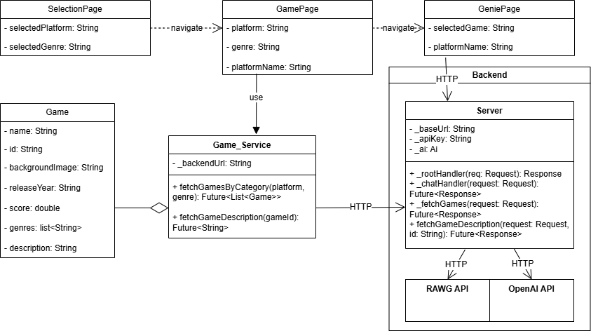

# Inhaltsverzeichnis

1. Einleitung
   - Benutzeranleitung
   - Problemstellung
   - Zielsetzung
   - Vorgehensweise
2. Verwendete Technologien
3. Klassen-Diagramm
4. Frontend
   - Selection Page
   - Game Page
   - Game Service
   - Genie Page
5. Backend
   - Server
6. Schlussbetrachtung
   - Ergebnis
   - Ausblick

# Abbildungsverzeichnis

- Retro-Gaming-Genie: https://de.pinterest.com/pin/391531761375839444/
- Öl-Lampe: https://de.pinterest.com/pin/483081497573745977/

# 1. Einleitung

Die Anwendung erleichtert die Suche nach den besten Retro-Spielen, die nach Genre und Plattform gefiltert werden können. Darüber hinaus bietet sie dem Nutzer die Möglichkeit, mithilfe eines „Genies” auf dem Modell von ChatGPT Informationen zu den Spielen zu erhalten.

## Benutzeranleitung

Für die Benutzung der Applikation werden seitens des Anwenders zwei API-Keys benötigt. Einerseits ist ein Key von der Seite "https://rawg.io/apidocs" erforderlich, andererseits ein weiterer Key sowie eine dazugehörige Projekt- und Organisations-ID von der Seite "https://openai.com/api/". Die entsprechenden Informationen sind folglich in die secrets.json-Datei der Applikation einzufügen.

Damit die Applikation gestartet werden kann, ist es zunächst erforderlich, die Server.dart bei der Server-Applikation auszuführen. Im Anschluss muss die main.dart bei der Flutter-Applikation im lib-Ordner ausgeführt werden. Für die Ausführung wird die Verwendung der Chrome-Web-Funktion empfohlen. Zudem ist die Installation der Abhängigkeiten Flutter und Dart auf dem VS Code erforderlich.

## Problemstellung

Die Suche nach Retro-Spielen, die sich an den Kriterien Konsole und Genre orientiert, ist ein zeitaufwendiger Prozess. Es ist erforderlich, sich durch mehrere Seiten zu klicken, Cookies zu akzeptieren und Datenschutzerklärungen zuzustimmen. In der Regel werden dem Nutzer dabei zu viele Informationen und zu wenige Daten bereitgestellt. Eine zusätzliche, konkrete Suche mit künstlicher Intelligenz erfordert eine erneute Eingabe von Spielen oder Suchkriterien, die ebenfalls optimiert werden könnte.

## Zielsetzung

Die Zielsetzung dieser Applikation besteht in der Optimierung des Prozesses der Spielsuche auf dem Handheld "Ambernic RG35XX SP". Dieses Handheld verfügt über die Funktionalität der Emulation diverser Retro-Konsolen, was dazu führt, dass kontinuierlich neue Spiele gesucht werden.

Die Spezifikationen der Applikation sind demnach eingeschränkt. Es ist festzustellen, dass die Konsole nicht in der Lage ist, PS2- oder GameCube-Spiele zu emulieren. Dennoch besteht der Wunsch, diese Option zu haben, da die Spiele auf dem PC-Handheld, dem sogenannten "Steam Deck", gespielt werden können und der Kategorie der Retro-Spiele zuzuordnen sind.

## Vorgehensweise

Aus technologischer Perspektive stellt diese Anwendung eine Erweiterung der Applikation aus dem Modul von Prof. Dr. Christian dar. Herr Soltanborn entwickelte eine einfache Chat-GPT-Server-Applikation im Bereich des Moduls: "Web-Entwicklung".

Diese Applikation bildet das Fundament und die Informationen zu ihrer Installation sowie zu ihrer Erklärung sind in den Skripten und Vorlesungen des Moduls zu finden. Eine detaillierte Erörterung dieser Aspekte ist an dieser Stelle nicht Gegenstand der Untersuchung.

Die vorliegende Ausarbeitung widmet sich der technischen Umsetzung der von mir adaptierten Entwicklungen, die auf dem von Herrn Solternborn entwickelten Grundgerüst basieren.

Die Ausarbeitung gliedert sich in die Beschreibung der verwendeten Technologien, die Funktionsweise des Frontends und Backends, sowie eine Schlussbetrachtung mit einem Ausblick auf mögliche zukünftige Entwicklungen der App.

# 2. Verwendete Technologien

Die Applikation wurde unter Verwendung von VS-Code erstellt.

Wie bereits dargelegt, finden in der vorliegenden Anwendung zwei API-Lösungen Anwendung, nämlich OpenAI und RAWG. Die Zuständigkeit für die Verarbeitung der Benutzerfragen an die KI obliegt OpenAI, während die Bereitstellung der grundlegenden Spielinhalte, die in der Liste aufgeführt werden sollten, dem Bereich RAWG obliegt.

Darüber hinaus findet bei der Entwicklung die Dart-Sprache Anwendung, da das Framework Flutter zum Einsatz kommt. Die Verwendung des Flutter Frameworks gründet auf der Anwendung durch Herrn Soltenborn.

Des Weiteren findet die Technologie GitHub Verwendung, um ein Repositorium für die Evaluierung der Applikation zu bereitstellen.

- **Git & GitHub**: 
- **RAWG API**: https://rawg.io/apidocs
- **OpenAI API**: https://platform.openai.com/docs
- **Flutter**: https://flutter.dev
- **Dart**: https://dart.dev

# 3. Klassen-Diagramm

Das beigefügte Klassendiagramm veranschaulicht die grundlegenden Funktionsweisen der Applikation. Eine Analyse des vorliegenden Systems ergibt eine deutliche Abgrenzung zwischen dem Frontend und dem Backend. Die Applikation setzt sich aus drei stateless Widgets zusammen, die die Funktion von Pages erfüllen. Darüber hinaus existieren zwei weitere Klassen: eine Service-Klasse und eine Strukturklasse. Des Weiteren ist im Backend ein Server vorhanden. Die nachfolgenden Abschnitte werden sich detaillierter mit den einzelnen Klassen befassen.

# 4. Frontend

Der Frontend bezeichnet den Bereich, über den der Nutzer mit der Software interagiert. In erster Linie betrifft dies die Seiten (Pages) der Applikation. Obwohl sich sowohl die Strukturklasse "game" als auch die Serviceklasse im Frontend befinden, besteht für den Benutzer keine direkte Interaktionsmöglichkeit mit diesen. Die primäre Funktion dieser Klassen besteht in der Sicherstellung der korrekten Anzeige von Dateien durch die Pages und der Bereitstellung einer Schnittstelle zum Backend.

Zur Gewährleistung einer einheitlichen und sauberen Darstellung der Textinhalte findet der Schriftzug "Press Start 2P" Anwendung. Die vorliegende Schriftart fügt sich in thematischer Hinsicht nahtlos in das Retro-Konzept ein und harmoniert zudem mit den anderen pixelartigen grafischen Elementen.

Press Start 2P: https://fonts.google.com/specimen/Press+Start+2P

Im Rahmen der Implementierung der Schriftart oder anderer Bilder wurde im Verzeichnis der Flutter-Anwendung ein Verzeichnis mit der Bezeichnung "Assets" angelegt. Im Rahmen der Zuweisung einzelner Elemente ist zudem ein Eintrag im "pubspec.yaml"-File des betreffenden Verzeichnisses vorzunehmen, um eine korrekte Zuweisung zu gewährleisten.

## Selection Page

Die Bezeichnung "Selektion Page" ist im Kontext ihrer Funktion als selbst erklärend zu betrachten. An dieser Stelle besteht für die Nutzer:innen die Option, den Genre- und Plattformwunsch zu spezifizieren. Zu diesem Zweck werden Spinner eingesetzt. Dem Nutzer wird die Option geboten, aus einer Auswahl an Retro-Spielekonsolen verschiedener Hersteller, darunter Sony, Nintendo und Sega, zu wählen. Die zur Auswahl stehenden Genres umfassen beispielsweise Action, RPG (Rollenspiel) und Shooter (Ego-Shooter).

Damit die Weitergabe korrekt durchgeführt werden kann, wurde diese Klasse um eine sogenannte Mapping-Tabelle erweitert. Diese transformiert die Platform-Namen in Codes, da die Suche nur mit der Übermittlung der Codes für die Platformen korrekt funktioniert.

Des Weiteren findet sich auf dieser Seite eine kurze Einleitung, die in drei Schritten die Funktionsweise der Applikation erläutert. Die Formatierung der Benutzeranweisung weist eine hohe Ähnlichkeit mit den Listeneinträgen auf, die auf der nächsten Seite, dem sogenannten "Game-Page", zu finden sind. Zur Veranschaulichung wurde ein Pixel-Art-Bild verwendet, das eine Öllampe zeigt. Die vorliegende Anspielung nimmt Bezug auf das im Genie Page dargestellte Genie. Der Fokus der Betrachtung liegt aktuell noch auf dem Phänomen des Genies, welches sich in der Lampe manifestiert.

## Game Page

Im Rahmen des "Game Page" erfolgt die Verwendung der Angaben aus dem "Selection Page", um mittels des "Game Service" das konkrete Spiel zu laden. Im linken oberen Bereich des Interfaces werden dem Nutzer die von ihm ausgewählten Angaben zu Genre und Plattform angezeigt.

Die Spiele werden anhand des Mettacritic-Scores sortiert und dem Nutzer zur Verfügung gestellt.

Die Struktur der einzelnen Listeneinträge wird in der Strukturklasse "Game" definiert. Die einzelnen Listeneinträge enthalten spezifische Informationen, die sich auf den Titel, das Erscheinungsjahr, das Genre, den Metacritic-Score und eine detaillierte Beschreibung beziehen.  Zur adäquaten Darstellung der Listeneinträge wird ein "List View Builder" verwendet, der die einzelnen Zeilen mit Inhalt versieht.

Im Falle fehlender Informationen, beispielsweise bei Abwesenheit eines Bildes, wird ein Bild aus der standardmäßig übertragenen Asset Library der Flutter-Anwendung gezogen. Bei fehlender Metacritic-Score wird dieser bei Null belassen.

Bei der initialen Aufruf der Seite sind keine Beschreibungen vorhanden. Um die Beschreibungen aufzurufen, ist es erforderlich, dass der Nutzer auf den Button "Load Description" klickt. Dieser Umstand ist darauf zurückzuführen, dass das Laden der Beschreibung einen zusätzlichen REST-Abruf an die API erfordert. Aufgrund der Tatsache, dass die kostenfreie Version der API genutzt wird, ist eine Beschränkung der Zugriffe erforderlich. Zudem ist es nicht notwendig, sämtliche Beschreibungen simultan einzusehen, da dies ansonsten zu einer unübersichtlichen Benutzeroberfläche der Applikation führt.

Des Weiteren wurde den Inhalten ein zusätzlicher Button zugewiesen, der mit "Ask Genie" betitelt ist und in den Listeneinträgen erscheint. Der vorliegende Button erfüllt die Funktion, den Nutzer auf die nächste Seite zu schalten und dabei den Kontext des Spiels sowie des Auswahls zu übermitteln. In Anbetracht der Tatsache, dass die Spiele zumeist auf mehreren Konsolen publiziert wurden, ist die Angabe der Konsole von signifikanter Relevanz.

## Game Service

Die als "Game Service"-Klasse bezeichnete Komponente fungiert als Schnittpunkt zum Backend-Server. Sein Aufgabengebiet umfasst die Einholung der Liste der Spiele als Future sowie die Beschaffung der Beschreibung eines Spiels als Future. Die vorliegende Funktion zielt darauf ab, die Funktionalität des "Game Pages" sicherzustellen.

## Genie Page

Der "Genie Page" erhält den Kontext des Spielnamens sowie der ausgewählten Plattform. Des Weiteren werden die Informationen dem Nutzer oben auf der Benutzeroberfläche angezeigt. Dem Nutzer wird die Möglichkeit geboten, dem Retro-Gaming-Genie, das aus der Öl-Lampe hervorgegangen ist, eine Frage zum Spiel zu stellen.

Zu diesem Zweck besteht für die Nutzer*innen die Möglichkeit, eine Nachricht zu verfassen. Mögliche Formulierungen sind beispielsweise: "Wie lange dauert das Spiel, bis es endet?" oder "Wie hoch ist die Anzahl der FPS?"

Damit die Anfrage an das Genie gesendet werden kann, ist es erforderlich, dass der Nutzer auf den Button in der unteren rechten Ecke klickt. Dadurch wird die Anfrage verschickt. Daraufhin wird neben dem Genie Bild die Antwort angezeigt.

Eine Analyse der Technologie des Genie Pages ergibt eine hohe Ähnlichkeit mit der von Herrn Solternborns App. Der vorliegende Unterschied besteht darin, dass eine Anpassung der Benutzeroberfläche vorgenommen wurde, um eine Einschränkung des Genies mit seinem Prompt im Kontext des Spiels zu bewirken.

Die Verarbeitung der Nachtarbeit sowie die Beantwortung der Nachrichten erfolgen im Backend-Server.

# 5. Backend

## Server 

Im Backend findet ausschließlich die Server-Applikation Beachtung. Die Zuständigkeit dieser Instanz umfasst die Bearbeitung und den Empfang von REST-API-Abfragen für die beiden APIs. Der Fokus der vorliegenden Untersuchung liegt auf der Funktionalität des Chatbots, wobei eine detaillierte Analyse dieses Aspekts nicht Gegenstand der vorliegenden Arbeit ist.

Im Rahmen der Implementierung wurden insbesondere jene Methoden relevant, die für das Abrufen von Spielelisten sowie die konkrete Beschreibung von Spielen erforderlich sind. Die Abrufe an der API werden durch das URL des RAWG in Verbindung mit dem RAWG Key formuliert und verarbeitet. Der RAWG Key ist in der "secrets.json"-Datei zu finden.

Die vorliegenden Listen oder Beschreibungen werden als JSON-Dateien übertragen und anschließend durch den GameService in einzelne Game-Listen transformiert.

Aus sicherheitstechnischer Sicht ist die Trennung von Front- und Backend von entscheidender Bedeutung, da die Zugriffe mittels API Keys im Frontend eine signifikante Sicherheitslücke aufweisen würden. Der Nutzer könnte demnach den Key mit Leichtigkeit aus dem Frontend extrahieren und für sich verwenden. Darüber hinaus ermöglicht diese Trennung eine übersichtliche Darstellung der Funktionalitäten einzelner Komponenten.

# 6. Schlussbetrachtung

## Ergebnis

Die Applikation "Resto-Gaming-Genie" offeriert eine benutzerfreundliche Option, Spiele zu entdecken, und ermöglicht die Interaktion mit einem interaktiven "Genie" bezüglich der Auswahl.

Die Benutzeroberfläche zeichnet sich durch eine stringente Struktur und Darstellung aus, die in Einklang mit dem Thema Retro steht. Dies wird durch die Verwendung einer spezifischen Schriftart, Farbe und Bilder erreicht.

Die Benutzererfahrung ist intuitiv und einfach gestaltet. Die Interaktion mit einer KI, die durch eine Personifikation charakterisiert ist, stellt eine Abkehr von der vorherrschenden Monotonie des KI-Chatbot-Erlebnisses anderer Anbieter dar. Darüber hinaus wird sichergestellt, dass potenzielle Abweichungen von den bereitgestellten Inhalten abgedeckt werden und der Nutzer ein Gefühl der Freiheit im Wissenserwerb verspürt.

## Ausblick

Die vorliegende Applikation erfüllt den Zweck der Spielesuche für Retro-Konsolen. Die Hinzufügung weiterer Konsolen und Genres in Abhängigkeit der 
Spielstände von RAWG ist grundsätzlich möglich, wobei jedoch darauf hingewiesen werden muss, dass alle relevanten Funktionalitäten bereits gegeben sind.

# Hilfsmittel

Für die Erstellung der Ausarbeitung wurde hinsichtlich der Darstellung und Grammatik der Texte die Seite von DeepL.Write benutzt (https://www.deepl.com/de/write). Die vorliegende Sprachkünstliche Intelligenz ist nicht generativ, sondern passt lediglich den bestehenden Text hinsichtlich der Darstellung an. Insofern ist sie nicht zu einer inhaltlichen Veränderung fähig.

Darüber hinaus fand der integrierte Co-Pilot von VS Code Verwendung zur Code-Vollendung sowie zur Unterstützung bei der Debugging-Prozedur.

# Ehrenwörtliche Erklärung 

Hiermit erkläre ich, dass ich die vorliegende Ausarbeitung selbständig angefertigt habe. Es wurden nur die in der Arbeit ausdrücklich be-nannten Quellen und Hilfsmittel benutzt. Wörtlich oder sinngemäß übernommenes Gedankengut habe ich als solches kenntlich gemacht. Diese Arbeit hat in gleicher oder ähnlicher Form ganz oder teilweise noch keiner Prüfungsbehörde vorgelegen.
